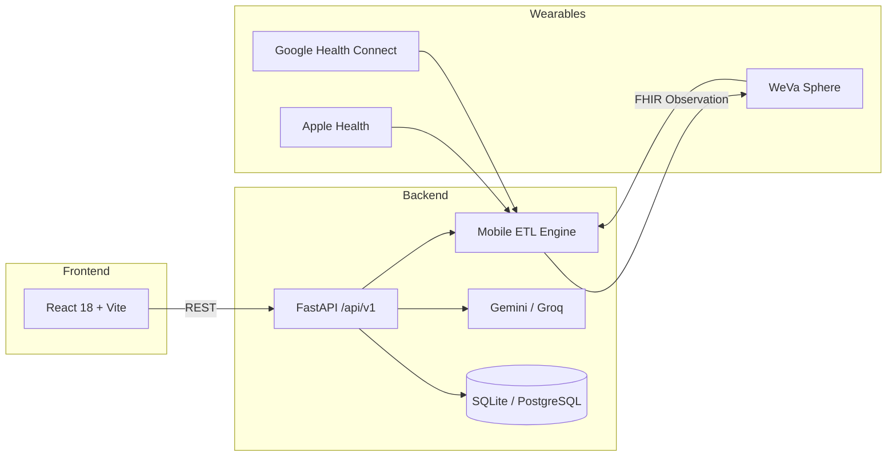

# Empowered Care · Wellness Reimagined

> The first federated health companion built for Africa — unifying wearable data, chronic disease detection, and community into one living intelligence.

[](https://alx-8xu3.onrender.com/docs)
[](https://fastapi.tiangolo.com/)
[](https://react.dev/)
[](https://www.python.org/)

Built for **Wellness Hackathon 2026** · ALX Africa · Addis Ababa, Ethiopia

---

## Overview

Empowered Care is a full-stack health platform designed for Ethiopian wellness contexts. It ingests signals from Apple Health, Google Health Connect, and WeVa Sphere, runs them through a mobile ETL pipeline, and surfaces clinical-grade FHIR observations — all while keeping the user at the center of a federated, privacy-respecting data model.

**Live API docs:** [https://alx-8xu3.onrender.com/docs](https://alx-8xu3.onrender.com/docs)
**Live FrontEnd :**  https://alx-1-b8sz.onrender.com/

---

## Features

| Module | Description |
|--------|-------------|
| **Chronic Disease Sentinel** | Real-time hypertension and diabetes risk from 72-hour wearable analysis |
| **Mental Grounding Engine** | HRV + screen-time correlation detects burnout; triggers grounding sessions |
| **EFCT 2025 Nutrition** | Glycemic load tracking for Injera, Teff, Shiro, and Ethiopia's food composition table |
| **Community Watch** | Trusted peers receive automatic alerts when biometrics go critical |
| **B2B Integrations** | API hooks for gym trainers, Kuriftu Resorts spa engine, and WeVa Sphere clinical records |
| **FHIR Explorer** | Live HL7 FHIR R4 Observation generator with LOINC semantic codes |

---

## Architecture



**Data flow:** Wearables → Extract → Transform (LOINC normalization) → Deliver (FHIR Observation resources)

---

## Tech Stack

### Backend
- **FastAPI** — async REST API with OpenAPI/Swagger
- **SQLModel + SQLAlchemy** — ORM and data models
- **Alembic** — database migrations
- **bcrypt + python-jose** — password hashing and JWT auth
- **Google Generative AI / Groq** — LLM-powered recommendations and intelligence
- **psycopg2** — PostgreSQL support for production

### Frontend
- **React 18** + **Vite 8**
- **React Router v6** — client-side routing with page transitions
- **Tailwind CSS v4** — utility-first styling
- **Recharts** — biometric and wellness visualizations
- **Playfair Display · DM Sans · JetBrains Mono** — brand typography

---

## Project Structure

```
alx/
├── backend/
│   ├── app/
│   │   ├── api/v1/endpoints/   # Route handlers (auth, health, fhir, …)
│   │   ├── core/               # Config, security, JWT
│   │   ├── db/                 # Session, base models
│   │   ├── models/             # SQLModel table definitions
│   │   ├── schemas/            # Pydantic request/response schemas
│   │   ├── services/           # LLM, intelligence, notifications
│   │   └── main.py             # FastAPI app entry point
│   ├── requirements.txt
│   └── runtime.txt             # Python 3.11.9 for Render
│
└── frontend/
    ├── src/
    │   ├── pages/              # Landing, Dashboard, Community, FHIR, …
    │   ├── components/         # DashShell, Sidebar, charts, UI
    │   ├── lib/api.js          # API base URL config
    │   └── App.jsx             # Router setup
    ├── .env                    # VITE_API_BASE_URL
    └── package.json
```

---

## Quick Start

### Prerequisites

- **Node.js** 18+
- **Python** 3.11+
- *(Optional)* PostgreSQL for production

### 1. Clone the repository

```bash
git clone https://github.com/empowered-care/alx.git
cd alx
```

### 2. Backend

```bash
cd backend
python -m venv .venv
source .venv/bin/activate        # Windows: .venv\Scripts\activate
pip install -r requirements.txt
```

Create `backend/.env` (optional — defaults work for local dev):

```env
SECRET_KEY=change-me-in-production
DATABASE_URL=sqlite:///./empowered_care.db
GEMINI_API_KEY=your-gemini-key
GROQ_API_KEY=your-groq-key
```

Start the API server:

```bash
uvicorn app.main:app --reload --host 0.0.0.0 --port 8000
```

API available at:
- **Root:** http://localhost:8000
- **Swagger UI:** http://localhost:8000/docs
- **ReDoc:** http://localhost:8000/redoc

### 3. Frontend

```bash
cd frontend
npm install
```

For local backend, create or edit `frontend/.env`:

```env
VITE_API_BASE_URL=http://localhost:8000
```

Start the dev server:

```bash
npm run dev
```

Open **http://localhost:5173**

---

## Environment Variables

### Backend (`backend/.env`)

| Variable | Default | Description |
|----------|---------|-------------|
| `SECRET_KEY` | `YOUR_SECRET_KEY_HERE` | JWT signing secret — **change in production** |
| `DATABASE_URL` | `sqlite:///./empowered_care.db` | Database connection string |
| `GEMINI_API_KEY` | — | Google Gemini API key |
| `GROQ_API_KEY` | — | Groq API key |
| `GROQ_MODEL_NAME` | `llama-3.1-8b-instant` | Groq model identifier |
| `PRIMARY_LLM` | `gemini` | Primary LLM provider (`gemini` or `groq`) |

### Frontend (`frontend/.env`)

| Variable | Default | Description |
|----------|---------|-------------|
| `VITE_API_BASE_URL` | `https://alx-8xu3.onrender.com` | Backend API base URL (no trailing slash) |

---

## API Reference

All routes are prefixed with `/api/v1`.

| Tag | Endpoint | Method | Description |
|-----|----------|--------|-------------|
| **auth** | `/auth/register` | POST | Register a new user |
| **auth** | `/auth/login` | POST | Login and receive JWT token |
| **users** | `/users/me` | GET | Current user profile |
| **health** | `/health/dashboard` | GET | Aggregated dashboard metrics |
| **health** | `/health/metrics` | GET | Raw health metric history |
| **wearables** | `/wearables/sync` | POST | Sync wearable data |
| **nutrition** | `/nutrition/search` | GET | Search EFCT food database |
| **nutrition** | `/nutrition/log` | POST | Log a meal |
| **intelligence** | `/intelligence/risk-analysis` | GET | Chronic disease risk analysis |
| **recommendations** | `/recommendations/` | GET | Personalized wellness recommendations |
| **community** | `/community/peers` | GET | Community watch peer list |
| **community** | `/community/add-peer` | POST | Add a trusted peer |
| **community** | `/community/check-in` | POST | Peer wellness check-in |
| **trainer** | `/trainer/clients` | GET | Trainer client roster |
| **kuriftu** | `/kuriftu/recommend` | POST | Spa restoration prescription |
| **fhir** | `/fhir/observation` | POST | Push FHIR R4 Observation to WeVa |

Full interactive docs: **[https://alx-8xu3.onrender.com/docs](https://alx-8xu3.onrender.com/docs)**

---

## Frontend Routes

| Route | Page | Description |
|-------|------|-------------|
| `/` | Landing | Marketing homepage |
| `/dashboard` | Dashboard | Live biometrics, nutrition, sentinel alerts |
| `/community` | Community | Peer monitoring and activity feed |
| `/fhir` | FHIR Explorer | Build and push LOINC-coded observations |
| `/grounding` | Grounding | Mental wellness grounding sessions |
| `/trainer` | Trainer | B2B gym trainer client dashboard |

---

## Test Credentials

A seed user is created automatically on first startup:

| Field | Value |
|-------|-------|
| Email | `test@example.com` |
| Password | `password` |
| Role | `ADMIN` |

---

## Deployment (Render)

### Backend Web Service

| Setting | Value |
|---------|-------|
| **Root Directory** | `backend` |
| **Build Command** | `pip install -r requirements.txt` |
| **Start Command** | `uvicorn app.main:app --host 0.0.0.0 --port $PORT` |
| **Python Version** | `3.11.9` (via `runtime.txt` or `PYTHON_VERSION` env var) |

**Recommended environment variables on Render:**

```env
PYTHON_VERSION=3.11.9
SECRET_KEY=<long-random-secret>
DATABASE_URL=<render-postgres-connection-string>
GEMINI_API_KEY=<optional>
GROQ_API_KEY=<optional>
```

> **Note:** SQLite data is ephemeral on Render. Use a Render PostgreSQL instance for persistent storage.

### Frontend Static Site

| Setting | Value |
|---------|-------|
| **Root Directory** | `frontend` |
| **Build Command** | `npm install && npm run build` |
| **Publish Directory** | `dist` |

```env
VITE_API_BASE_URL=https://alx-8xu3.onrender.com
```

---

## Integrations

- **Apple Health** / **Google Health Connect** — wearable signal ingestion
- **WeVa Sphere** — clinical FHIR record destination
- **Kuriftu Resorts** — spa and wellness prescription engine
- **EFCT 2025** — Ethiopian Food Composition Table for nutrition tracking

---

## Wellness Hackathon 2026

| | |
|---|---|
| **Theme** | Heal · Build · Thrive |
| **Day 1** | June 6, 2026 · Capstone ALX Tech Hub, Lideta |
| **Finals** | June 14 · Kuriftu Africa Village, Burayu |
| **Grand Prize** | 150K ETB |
| **Tracks** | 5 wellness tracks · 48h build sprint |

---

## Development

```bash
# Backend — run with hot reload
cd backend && uvicorn app.main:app --reload

# Frontend — lint
cd frontend && npm run lint

# Frontend — production build
cd frontend && npm run build && npm run preview
```

---

## License

This project was built as part of the ALX Africa Wellness Hackathon 2026. All rights reserved by the Empowered Care team.

---

<p align="center">
  <strong>Your body is already speaking. Start listening with Empowered Care.</strong><br/>
  <sub>Wellness Hackathon 2026 · ALX Africa · Addis Ababa, Ethiopia</sub>
</p>
